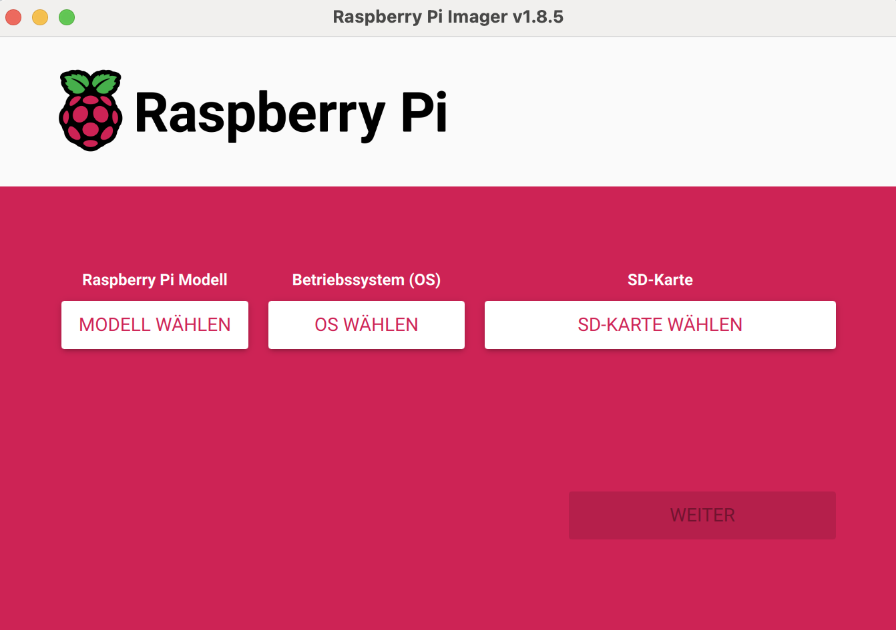

# rpi
raspberry pi stuff

## Installation

### Hardware requirements

  

Go to 

https://www.raspberrypi.com/software/

and install raspberry image app

  

Insert SD card

  

Start the app

  

Select your device

  

continue

  

> **Note:** If you have a keyboard, a mouse and a monitor and can connect them, the following settings can also be carried out later directly on the monitor.

Settings:

  

  

# How to Create an SSH Key on macOS and Windows  

Secure Shell (SSH) keys provide a secure way to authenticate with remote servers without using passwords. Here’s how to generate an SSH key on **macOS** and **Windows**.

---

## **🔑 Creating an SSH Key on macOS**  
1. **Open Terminal** (`Cmd + Space`, type "Terminal", and press Enter).  
2. Run the following command to generate an SSH key:  
   ```sh
   ssh-keygen -t rsa -b 4096 -C "your_email@example.com"
   ```
   - `-t rsa` → Uses the RSA algorithm.  
   - `-b 4096` → Creates a strong 4096-bit key.  
   - `-C "your_email@example.com"` → Adds an identifier (your email).  

3. When prompted, press **Enter** to save the key in the default location (`~/.ssh/id_rsa`).  
4. Set a **passphrase** (optional but recommended).  
5. Copy the public key to your clipboard:  
   ```sh
   cat ~/.ssh/id_rsa.pub | pbcopy
   ```
6. Add the key to an SSH agent:  
   ```sh
   eval "$(ssh-agent -s)"
   ssh-add ~/.ssh/id_rsa
   ```
7. Your SSH key is now ready to use!

---

## **🖥️ Creating an SSH Key on Windows**  

### **Option 1: Using PowerShell (Recommended)**
1. Open **PowerShell** (Win + X → Windows Terminal / PowerShell).  
2. Run the SSH keygen command:  
   ```powershell
   ssh-keygen -t rsa -b 4096 -C "your_email@example.com"
   ```
3. Press **Enter** to save in the default location (`C:\Users\YourUser\.ssh\id_rsa`).  
4. Set a **passphrase** if desired.  
5. Copy the public key:  
   ```powershell
   Get-Content $env:USERPROFILE\.ssh\id_rsa.pub | Set-Clipboard
   ```
6. Start the SSH agent and add the key:  
   ```powershell
   Start-Service ssh-agent
   ssh-add $env:USERPROFILE\.ssh\id_rsa
   ```

### **Option 2: Using PuTTY (For Older Windows Versions)**
1. Download **PuTTYgen** from [PuTTY's website](https://www.chiark.greenend.org.uk/~sgtatham/putty/latest.html).  
2. Open PuTTYgen → Click **Generate** → Move your mouse randomly to create entropy.  
3. Save the **private key** (`.ppk`) and **public key**.  
4. Add the key to SSH authentication.

---

## **🔗 Using the SSH Key**  
Once your key is generated, add the **public key** (`id_rsa.pub`) to your remote server or services like GitHub/GitLab by pasting it into the SSH settings.

Now, you can connect securely without using passwords! 🚀


  

Insert card to raspberry pi:

  

Connect to power supply:

  

connect to your raspberry via ssh:

ssh pi@bix-rpi-0.local

> *Note:* This will only work if your router could resolve the name via DNS otherwise start with the ip address.

You can add the following entry to your ~/.ssh/config:

```config
Host rpi0
Hostname bix-rpi-0.local # or the ip address here
StrictHostKeyChecking no
User pi
IdentityFile ~/.ssh/id_rsa
```

# K3s

https://medium.com/@stevenhoang/step-by-step-guide-installing-k3s-on-a-raspberry-pi-4-cluster-8c12243800b9

